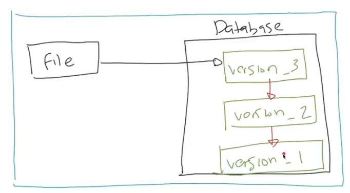
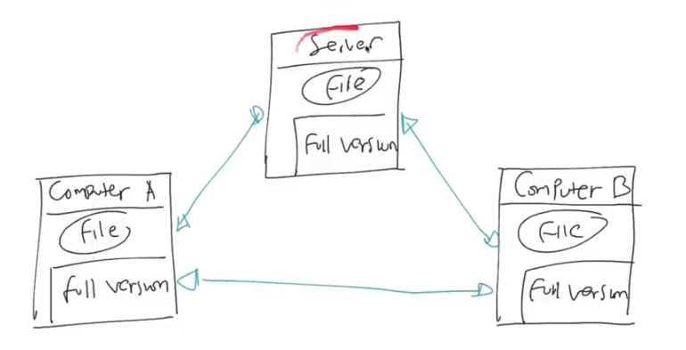

# بِسْمِ اللهِ الرَّحْمَنِ الرَّحِيْم

---

### Dibuat berdasarkan hasil belajar dari Tutorial Youtube Pak Eko: https://youtu.be/fQbTeNX1mvM

# Git Dasar

---

## 0. Agenda

- Pengenalan Version Control
- Pengenalan Git
- Repository
- The three Tree
- Working Directory
- Stagging Index
- Commit
- Reset Commit
- Dan lain-lain

## 1. Sebelum Ada Version Control

- Saat kita mengerjakan sebuah **project / pekerjaan** kita akan
  sering sekali melakukan revisi, Misal saja kita membuat dokumen proposal atau skripsi.

- Biasanya kita akan menyimpan dokumen pertama dengan nama
  **Document_1**, setelah mendapat revisi, kita akan simpan dengan nama **Document_2**, jika masih terdapat revisi akan di simpan dengan nama **Document_3**, dan begitu pun seterusnya.

- Kenapa? Karena agar kita bisa mengetahui perubahan yang terjadi
  antar revisi pada Project kita, jika sewaktu-waktu kita perlu menggunakan revisi yang sebelumnya, kita bisa beralih dan menggunakanannya dengan mudah.

## 2. Version Control System (VCS)

- **Version Control System** disingkat **VCS** adalah sebuah system
  yang merekam perubahan pada file dari waktu ke waktu, sehingga kita bisa melihat versi sebelumnya jika diinginkan.

- Version Control sangat populer dikalangan programmer, karen
  programmer selalu membuat kode program dalam bentuk kode tulisan, Dengan version control, programmer bisa merekam semua perubahan yang terjadi, sehingga jika terjadi kesalahan, programmer bisa dengan mudah kembali ke versi sebelumya.

- Tapi tidak hanya untuk file dalam bentuk text, jika misal kita
  adalah seorang Graphic Designer, kita juga bisa memnafaatkan Version Control untuk merekam perubahan dari file gamber atau layout, sehingga kita tidak perlu membackup tiap perubahan secara manual.

## 3. Tipe Version Control

Secara garis besar, version control dibagi menjadi 3 jenis

**A. Local Version Control**

 - Local Version Control merupakan version control yang berjalan
   hanya di local komputer
 - Pendekatan ini biasa digunakan karena sederhana dan tidak butuh  
   server, karena semua riwayat pekerjaan disimpan di local komputer
 - Setiap perubahan versi yang terjadi pada file hanya disimpan di
   local komputer
 - Sulit untuk berkolaborasi dengan Team atau pengguna lain.
 - Jika komputer atau laptop kita rusak, maka seluruh data akan
     hilang.
 - Diagram Local Version Control :

  

#

**B. Centralized Vesion Control**

  - Masalah yang terjadi pada Local Version Control adalah, jika
    komputer rusak, maka seluruh data bisa hilang.
  - Selain itu agak sulit untuk berkolaborasi dengan pengguna lain jika file hanya ada di satu komputer.
  - Untuk menangani masalah ini, kita bisa menggunakan Centralized Version Control
  - Centralized Version Control menimpan seluruh data revisi di server
  - Pengguna bisa mengakses data ke server untuk melihat file
  - Kekurangannya adalah, jika pengguna offline, mereka tidak bisa melihat riwayat file karena semua riwayat hanya ada di server
  - jika server down, maka seluruh pengguna tidak bisa melakukan perubahan dan melihat revisi file
  - Contoh Centralized Version Control adalah Subversion
  - Diagram Centralized Version Control :

  

#

 **C. Distributed Version Control**

   - Distributed Version Control adalah alternatif dari Centralized Version Control
   - Dalam DVCs, client tidak hanya mengambil file versi terakhir, namun seluruh riwayat revisi di copy seluruhnya
   - Hal ini menjadikan jika terjadi masalah dengan server, client masih tetap bekerja, memanipulasi file, sampai melihat riwayat perubahan
   - Bahkan dalam DVCs, Server bisa lebih dari satu, karena tiap server isinya sama, full backup data
   - Contoh DVCs adalah Git, Mercurial dan lain-lain 
   - Diagram Distributed Version Control :

  

#
## 4. Sejarah Git

- **Git** muncul dengan latar belakang **OpenSource** project **Linux Kernel**
- Ttahun 1991 - 2002, **Linux Kernel** di develop hanya dengan memanfaatkan patch dan archive files
- Tahun 2002, **Linux Kernel** mulai menggunakan **DVCs** bernama **BitKeeper**
- Di tahun 2005, hubungan anatara perusahaan pemilik BitKeeper dengan komunitas Linux Kernel kurang baik, sehingga pembuat linux, Linus Torvals mulai membuat DVCs sendiri
- Git pertama kali dikenalkan tahun 2005, semakin kesini Git semakin populer dan sekarang menjadi DVCs yang paling populer di dunia.
- Git sangat cepat, ringan dan baik dalam me-manage project dengan ukuran besar

## 5. Pengenalan Git?

- Jadi, Git adalah salah satu DVCs yang ada
- Git tidak membutuhkan server untuk melakukan perubahan atau melihat riwayat revisi, hal ini dikarenakan dalam Git, semua riwayat project akan selalu di duplikasi, baik ini di server ataupun di local komputer
- Artinya sebenarnya Git juga bisa digunakan sebagai Local Version Control
- Setiap prubahan yang terjadi di Git akan selalu dibuat signature(tanda) nya emnggunakan algoritma hashingSha-1. Hal ini menjadikan perubahan sekecil apapun pasti bisa di deteksi oleh Git
- Semua hal yang terjadi di git secara otomatis akan dicatat, hal ini menjadikan perubahan sekecil apapun di Git, pasti selalu bisa dikembalikan ke versi sebelumnya
- 
**Git** adalah software salah satu **Distributed Version Control System** yang tidak membutuhkan server untuk melakukan perubahan atau melihat riwayat revisi, dikarenakan di dalam git, semua riwayat project akan selalu di duplikasi atau di copy baik itu di server maupun di local komputer kita, itu berarti Git juga bisa digunakan sebagai Local Version Control.

Setiap perubahan yang terjadi di **Git** pasti selalu di buat tanda (**signature**), karena Git menggunakan **algoritma hashing SHA-1**, dan menjadikan perubahan sekecil apapun akan terdeteksi olah **Git**. serta semua yang terjadi secara otomatis akan tercatat, dan menjadikan perubahan apapun di **Git** pasti bisa dikembalikan ke versi sebelumnya.

## 3. Repository

- Repository merupakan sebutan project di Git
- Kita bisa membuat folder kosong atau folder yang sudah berisi
  file, lalu membuatnya sebagai Git Repository
- Atau kita bisa melakukan clone Git Repository yang sudah ada dari
  Server Git

## 4. The Three Tree

## 5. Working Directory

## 6. Staging Index

## 7. Commit

## 8. Reset Commit

## 9. Dan lain-lain
